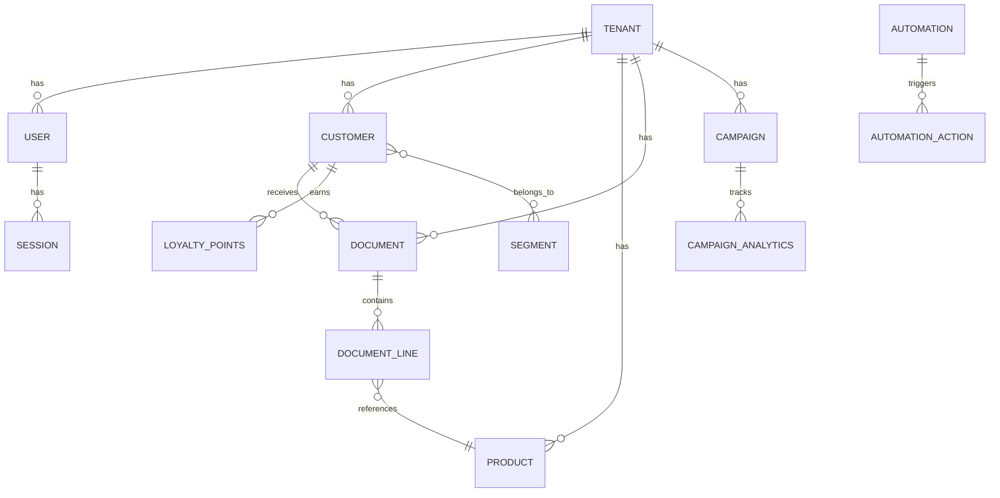

# 📚 Portfolio des Projets - Alexandre Goumain

<div align="center">

[](https://github.com/AlexandreGoumain)
[](https://www.linkedin.com/in/alexandre-goumain/)

---

*Documentation détaillée de mes projets et réalisations*

</div>

---

## 📋 Table des Matières

- [My Pro Partner - ERP SaaS](#-my-pro-partner---erp-saas)
- [Dashboard Demo](#-dashboard-demo)
- [TradingSpace](#-tradingspace)
- [RedditReach](#-redditreach-en-développement)
- [Compétences Techniques](#-compétences-techniques)

---

## 💼 My Pro Partner - ERP SaaS

<div align="center">

[](https://github.com/AlexandreGoumain/my-pro-partner)


</div>

### 📖 Description

**My Pro Partner** est une plateforme ERP SaaS complète conçue pour les artisans et PME. Elle offre une solution tout-en-un pour la gestion des clients, des stocks, des documents commerciaux et du marketing.

### 🏗️ Architecture

```
my-pro-partner/
├── 📁 src/
│   ├── 📁 app/                    # Next.js App Router
│   │   ├── 📁 (auth)/             # Routes d'authentification
│   │   ├── 📁 (dashboard)/        # Routes du dashboard
│   │   ├── 📁 api/                # API Routes (50+)
│   │   └── 📁 (marketing)/        # Landing page
│   ├── 📁 components/             # Composants React (100+)
│   │   ├── 📁 ui/                 # Shadcn/ui
│   │   ├── 📁 forms/              # Formulaires
│   │   └── 📁 dashboard/          # Composants dashboard
│   ├── 📁 lib/                    # Utilitaires
│   │   ├── 📁 auth/               # Configuration NextAuth
│   │   ├── 📁 db/                 # Prisma client
│   │   └── 📁 validations/        # Schémas Zod
│   └── 📁 hooks/                  # Custom React Hooks
├── 📁 prisma/
│   └── schema.prisma              # Schéma BDD (20+ tables)
└── 📁 public/                     # Assets statiques
```

### 💾 Modèle de Données



### 🔧 Stack Technique Détaillée

| Catégorie | Technologies |
|-----------|-------------|
| **Frontend** | Next.js 15, React 19, TypeScript 5.x (strict), Tailwind CSS v4, Shadcn/ui |
| **State Management** | TanStack Query (React Query), Zustand |
| **Forms** | React Hook Form + Zod |
| **Backend** | Next.js API Routes, Server Actions |
| **Auth** | NextAuth.js v4 (JWT + OAuth Google) |
| **Database** | PostgreSQL 16, Prisma ORM |
| **IA** | OpenAI GPT-4 API |
| **PDF** | React-PDF, jsPDF |
| **Email** | Resend, React Email |

### ✨ Fonctionnalités Détaillées

<details>
<summary><b>🏢 Architecture Multi-Tenant</b></summary>

- Isolation complète des données par tenant
- Système de rôles (Owner, Admin, User)
- Configuration personnalisée par entreprise
- Branding personnalisable

</details>

<details>
<summary><b>💳 Système d'Abonnement</b></summary>

| Plan | Prix | Limites |
|------|------|---------|
| FREE | 0€ | 50 clients, 100 produits |
| BASIC | 29€/mois | 500 clients, 1000 produits |
| PREMIUM | 79€/mois | 5000 clients, illimité produits |
| ENTERPRISE | Sur devis | Tout illimité + support dédié |

</details>

<details>
<summary><b>📊 CRM & Gestion Clients</b></summary>

- CRUD complet des clients
- Champs personnalisables
- Import/Export CSV
- Historique des interactions
- Segmentation avancée (prédéfinie + custom)
- Scoring client

</details>

<details>
<summary><b>📦 Gestion des Produits</b></summary>

- Catalogue produits avec catégories
- Gestion des stocks avec alertes
- Variantes produits
- Champs personnalisables
- Import/Export CSV
- Historique des mouvements

</details>

<details>
<summary><b>📄 Documents Commerciaux</b></summary>

- Devis, Factures, Avoirs
- Workflow Devis → Facture → Paiement
- Séries de numérotation personnalisables
- Génération PDF professionnelle
- Envoi par email
- Suivi des paiements

</details>

<details>
<summary><b>🎁 Programme de Fidélité</b></summary>

- Niveaux de fidélité configurables
- Accumulation automatique de points
- Récompenses par niveau
- Historique des mouvements de points
- Gamification (badges, challenges)

</details>

<details>
<summary><b>🤖 Chatbot IA</b></summary>

- Intégration OpenAI GPT-4
- Conversations contextuelles
- Function calling pour actions
- Historique des conversations
- Suggestions intelligentes

</details>

<details>
<summary><b>📈 Marketing Automation</b></summary>

- 6 types de triggers (inscription, achat, inactivité, etc.)
- Actions automatisées (email, SMS, notification)
- Campagnes EMAIL/SMS
- Analytics (ouvertures, clics, conversions)
- A/B Testing

</details>

### 📊 Métriques du Projet

| Métrique | Valeur |
|----------|--------|
| Lignes de code | ~50,000+ |
| Tables BDD | 20+ |
| API Routes | 50+ |
| Composants React | 100+ |
| Tests | En cours |
| Coverage TypeScript | 100% |

### 🔐 Sécurité

- ✅ Protection CSRF
- ✅ Authentification JWT + OAuth
- ✅ Validation Zod (runtime + compile-time)
- ✅ Rate limiting API
- ✅ Isolation multi-tenant
- ✅ Sanitization des inputs
- ✅ CORS configuré

---

## 📊 Dashboard Demo

<div align="center">

[](https://github.com/AlexandreGoumain/Dashboard)


</div>

### 📖 Description

Dashboard interactif avec visualisation de données en temps réel, graphiques dynamiques et KPIs business.

### 🔧 Stack Technique

| Catégorie | Technologies |
|-----------|-------------|
| **Frontend** | React, TypeScript |
| **Charts** | Chart.js, Recharts |
| **Styling** | Tailwind CSS |
| **State** | React Context |

### ✨ Fonctionnalités

- 📈 Graphiques interactifs (line, bar, pie, area)
- 📊 KPIs en temps réel
- 🔄 Rafraîchissement automatique des données
- 📱 Design responsive
- 🎨 Thèmes personnalisables
- 📥 Export des données (CSV, PDF)

---

## 📈 TradingSpace

<div align="center">

[](https://github.com/AlexandreGoumain/TradingSpace)


</div>

### 📖 Description

Suite d'outils d'automatisation pour l'analyse de marchés financiers avec alertes personnalisables.

### 🔧 Stack Technique

| Catégorie | Technologies |
|-----------|-------------|
| **Language** | JavaScript |
| **APIs** | APIs Finance (Yahoo, Alpha Vantage) |
| **Notifications** | Webhooks, Email |

### ✨ Fonctionnalités

- 📊 Analyse technique automatisée
- 🔔 Alertes personnalisables
- 📈 Suivi de portefeuille
- 📉 Backtesting de stratégies
- 🤖 Signaux de trading automatiques

---

## 🤖 RedditReach (En développement)

<div align="center">


</div>

### 📖 Description

Plateforme SaaS de monitoring Reddit pour la génération de leads B2B qualifiés.

### 🔧 Stack Technique Prévue

| Catégorie | Technologies |
|-----------|-------------|
| **Frontend** | Next.js, React, TypeScript |
| **Backend** | Node.js, Express |
| **Scraping** | Puppeteer, Cheerio |
| **Database** | PostgreSQL |
| **Queue** | Bull, Redis |

### ✨ Fonctionnalités Prévues

- 🔍 Monitoring de subreddits en temps réel
- 🎯 Filtrage par mots-clés
- 📊 Analytics et insights
- 🔔 Alertes instantanées
- 📈 Dashboard de leads
- 🤖 Scoring automatique des leads

---

## 🛠️ Compétences Techniques

### 💪 Maîtrise Avancée

```
Next.js       ████████████████████ 95%
React         ████████████████████ 95%
TypeScript    ████████████████████ 90%
Node.js       ████████████████████ 90%
PostgreSQL    █████████████████░░░ 85%
Prisma        █████████████████░░░ 85%
Tailwind CSS  ████████████████████ 95%
```

### 🔧 Compétent

```
Docker        ███████████████░░░░░ 75%
Redis         ██████████████░░░░░░ 70%
OpenAI API    █████████████████░░░ 85%
Python        ███████████████░░░░░ 75%
AWS           ████████████░░░░░░░░ 60%
```

### 📚 En Apprentissage

```
Kubernetes    ████████░░░░░░░░░░░░ 40%
GraphQL       ██████████░░░░░░░░░░ 50%
Terraform     ██████░░░░░░░░░░░░░░ 30%
```

---

## 📫 Contact

<div align="center">

[](https://www.linkedin.com/in/alexandre-goumain/)
[](https://github.com/AlexandreGoumain)
[](mailto:alexandre.goumain.pro@gmail.com)

---

**💼 Disponible pour des opportunités en CDI !**

*Dernière mise à jour : Décembre 2025*

</div>
